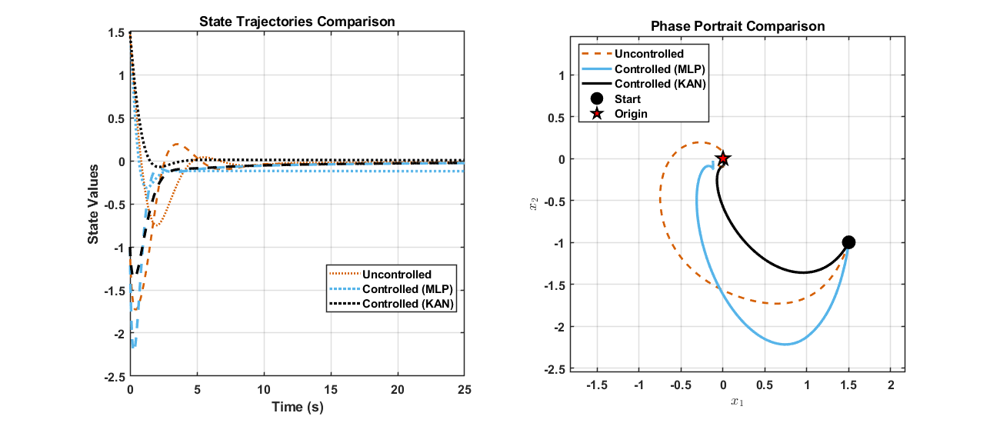

# Control of Fractional-Order Dynamical Systems using Kolmogorov–Arnold Networks

This repository contains the official implementation for the paper: **"Control of Fractional-Order Dynamical Systems using Kolmogorov–Arnold Networks"**, submitted to the 2026 American Control Conference (ACC).

**Authors:** Haowei(Alice) Chen, Joel Rosenfeld, Tansel Yucelen, and Rushikesh Kamalapurkar

## Abstract

This paper presents a control framework for input-affine fractional-order systems with unknown, nonlocal nonlinearities. We leverage Kolmogorov–Arnold Networks (KANs) to model these complex dynamics. The core theoretical contribution is a rigorous stability analysis of the closed-loop system, for which we establish sufficient conditions that guarantee the existence, uniqueness, and uniform stability of solutions. This analysis is validated through numerical simulations, and the framework's practical effectiveness is demonstrated on a mobile robot path-tracking problem, where a KAN-based controller successfully compensates for complex slip effects to significantly improve tracking accuracy.



## Repository Structure

This repository is organized into the main experiments presented in the paper:

```
.
├── FKAN_robotic/
│   ├── duffing_oscillator/       # Experiment 1: Fractional Duffing Oscillator
│   │   ├── FKAN_openloop.ipynb   # Notebook to train KAN and MLP on Duffing data
│   │   ├── FKAN_closedloop.m     # Script for closed-loop control simulation
│   ├── robot/                    # Experiment 2: Robot Path Tracking
│   │   ├── roboticFKAN_1.ipynb   # Notebook for the figure-eight tracking simulation
│   │   └── roboticFKAN_2.ipynb   # Notebook for the Causally-Informed KAN
└── README.md                     # This file
```


## Reproducing the Results

The code is structured to reproduce the key experiments from the paper.


## License

This project is licensed under the MIT License. See the `LICENSE` file for more details.
